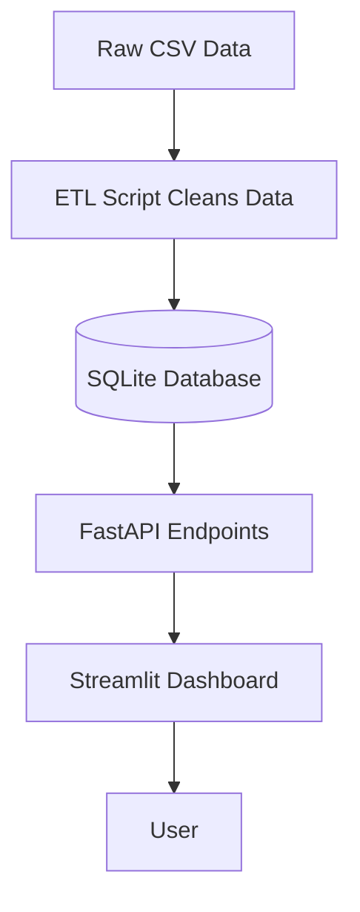

# Data Flow Diagram

```mermaid
graph TD
Raw[Raw CSV Data] --> ETL[ETL Script Cleans Data]
ETL --> DB[(SQLite Database)]
DB --> API[FastAPI Endpoints]
API --> FE[Streamlit Dashboard]
FE --> User[User]
```
